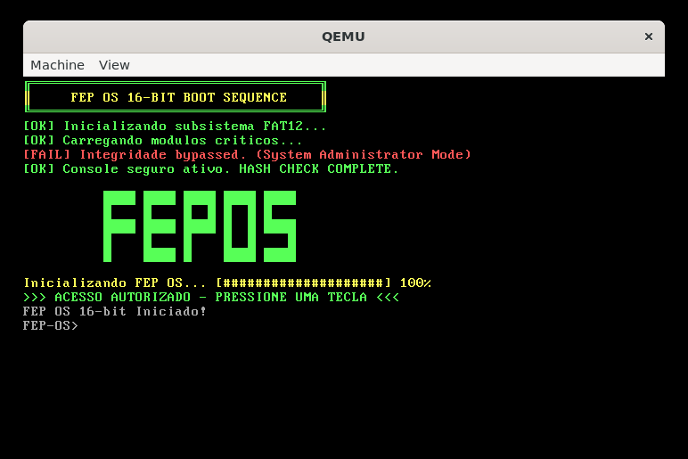

<div align="center">
  
</div>

# 🚀 FEP OS: Um Sistema Operacional Monolítico em Assembly x86 (16-bit)

Este projeto é o **FEP OS**, um sistema operacional experimental e educacional totalmente escrito em Assembly (NASM) para a arquitetura x86 em Modo Real (16 bits). Ele serve como um laboratório de baixo nível para explorar a arquitetura de kernels, *drivers* e sistemas de arquivos, semelhante aos sistemas DOS e CP/M.

## ⚠️ Filosofia de Desenvolvimento e Estágio Atual

O FEP OS está em **estágio inicial de desenvolvimento**. A base do código foi construída principalmente na base de **tentativa e erro** e na filosofia de **"programação orientada à gambiarra"**, onde a funcionalidade precede a elegância.

**Bugs são esperados e fazem parte da arquitetura!** Qualquer contribuição para refatorar o código, corrigir falhas de lógica (especialmente no *parsing* do FAT12) ou melhorar a estabilidade é extremamente bem-vinda e apreciada.

## ✨ Destaques Arquiteturais

O FEP OS foi projetado para simular um ambiente de kernel monolítico, com foco na eficiência do código 16-bit e na interação direta com a BIOS.

  * **Arquitetura Base:** Modo Real 16 bits, inicializado a partir do Boot Sector (BIOS `INT 13h`).
  * **Sistema de Arquivos:** Suporte robusto a **FAT12**, incluindo funções de alocação de cluster, leitura de cadeia de clusters e manipulação de diretórios.
  * **Interface:** Intérprete de Comandos (Shell) com roteamento de argumentos (`parse_command`) e suporte a execução de programas externos (`exec`).
  * **Gestão de I/O:** Utiliza interrupções da BIOS (`INT 10h` para Vídeo, `INT 16h` para Teclado) para máxima compatibilidade com hardware antigo e emulação (QEMU).

## 🗂️ Estrutura de Código Modular

Para facilitar a manutenção de um projeto em Assembly, o código é dividido em módulos bem definidos:

|      Pasta     |     Conteúdo Principal     |                           Função Arquitetural                                |
| :------------- | :------------------------- | :--------------------------------------------------------------------------- |
| `src/kernel/`  | `main.asm`, `data.asm`     | Coração do SO; inicialização, gerenciamento de memória e dados globais.      |
| `src/drivers/` | `video.asm`, `disk.asm`    | Camada de abstração de hardware via chamadas de BIOS (INTs).                 |
| `src/lib/`     | `string.asm`, `stdlib.asm` | Funções reutilizáveis (manipulação de strings, conversões BCD/Dec/Hex).      |
| `src/fs/fat12/`| `fat.asm`, `rootdir.asm`   | Lógica de alocação, busca e manipulação de dados no formato FAT12.           |
| `src/shell/`   | `shell.asm`, `commands/`   | O roteador de comandos (`process_command`) e a implementação de utilitários. |

## ⚙️ Comandos Implementados (Utilitários de Sistema e FS)

O Shell do FEP OS suporta um conjunto completo de comandos de sistema e manipulação de arquivos:

| Categoria | Comandos Chave |
| :--- | :--- |
| **Utilitários de FS** | `ls`, `cat`, `rm`, `cp`, `mv`, `mkdir`, `rmdir` |
| **Inspeção/Debug** | `hexdump`, `fatdump`, `grep`, `wc`, `head`, `tail`, `more` |
| **Sistema/Controle** | `ver`, `mem`, `time`, `date`, `reboot`, `shutdown`, `cls` |
| **Execução** | `exec`  |

## 🔧 Como Compilar e Executar (Pré-requisitos)

Para desenvolver, compilar e testar o FEP OS, você precisará das seguintes ferramentas em um ambiente Linux/WSL:

### Pré-requisitos (Requeridos):

  * **NASM** (Netwide Assembler): Para montar o código Assembly.
  * **dd** (Disk Dump): Para manipulação de imagens de disco binárias.
  * **mkfs.fat** (do pacote `dosfstools`): Para criar a imagem de disco FAT12.
  * **mtools** (principalmente `mcopy`): Para copiar arquivos do sistema host para a imagem FAT12.
  * **QEMU:** O emulador para executar o sistema operacional em 16-bit.

### Instruções de Execução

Use o script de *build* (`build.sh`) para automatizar o processo de compilação, formatação e execução da imagem de disco (`FEPOS.IMG`):

```bash
# 1. Compila os módulos de Assembly e cria a imagem de disco:
$ ./build.sh compile

# 2. Executa o FEP OS no emulador QEMU:
$ ./build.sh run 

# 3. Remove arquivos temporários e binários:
$ ./build.sh clean 
```
